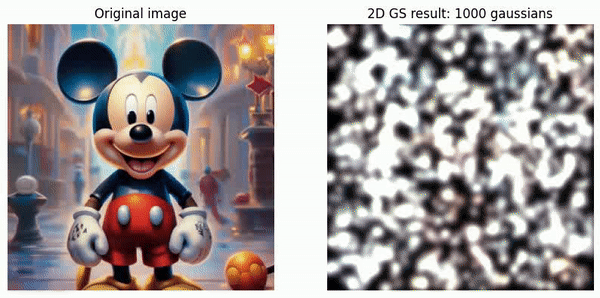
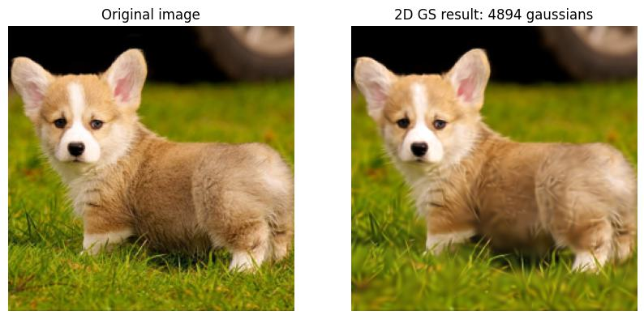
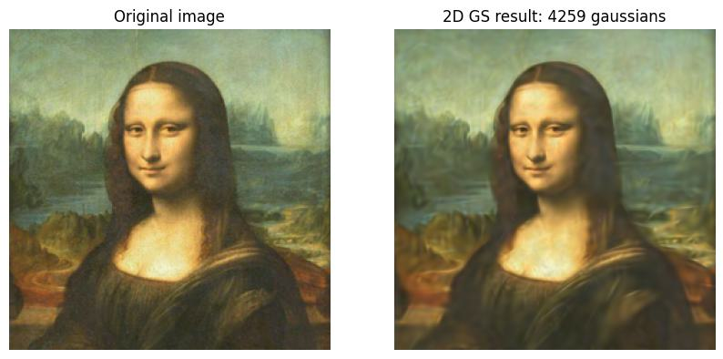
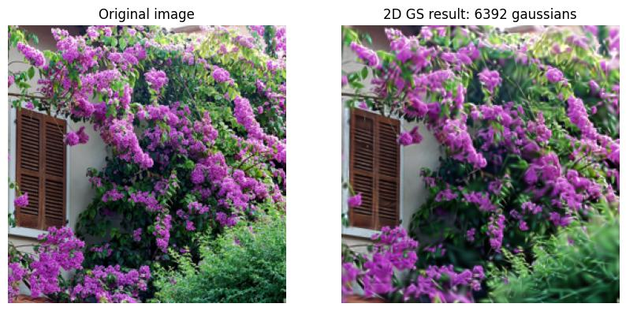
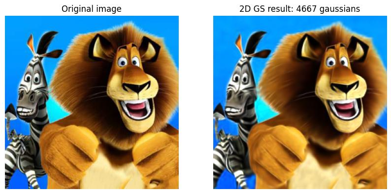

# 2D Gaussian Splatting

This repository contains implementation of awesone idea from [3D Gaussian Splatting](https://github.com/graphdeco-inria/gaussian-splatting/tree/main) for 2D case.

## Getting started
Clone repository:
```commandline
git clone https://github.com/kaaeaate/2d_gaussian_splatting.git
```
Install requirements as follows:
```commandline
conda env create --file requirements.yml
conda activate 2d_gaussian_splatting
```
Then run train.py:
```python
python3 train.py --image_path images/mikki.jpg --limit_points_number 10000
```
## Results
### Video results
<p align='center'> 

</p>

### Images results
The method works well for synthetic and smooth data. However, some issues appear in very tiny details like leaves on the 3rd image.
</p>
<p align='center'>
  
  
 
  
</p>


